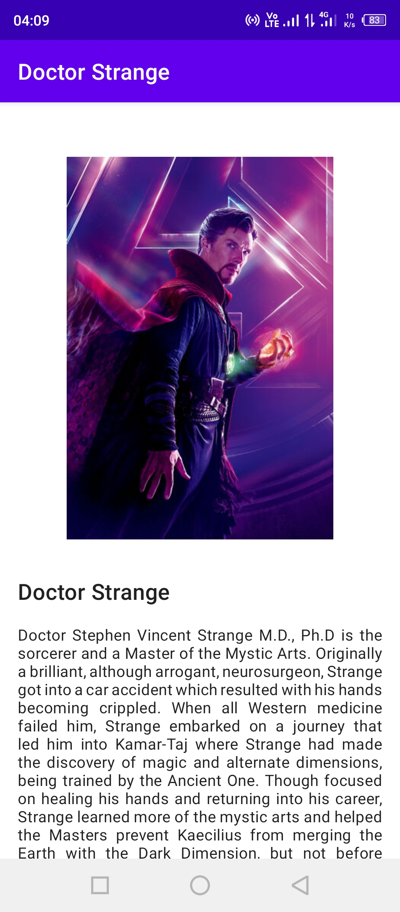

# TheAvengersHeroes

## About The Project
This is an android application that made for the final project submission of **"Belajar Membuat Aplikasi Android Untuk Pemula" (Android for Beginners)** course on Dicoding (2021). This application shows a list of Heroes that become the members of **The Avengers** along with the information for each heroes.

This project is almost similar with my other project **[IndonesianCollege](https://github.com/LinggarM/IndonesianCollege)** except this project is using **Kotlin** as the programming language and use more libraries.

## Screenshots
Splash Screen | Dashboard | Detail Page | About Page
:-------------------------:|:-------------------------:|:-------------------------:|:-------------------------:
  |    |    |  

## Features & Technology Used
* Android Studio
* Kotlin Programming Language
* Object-oriented Programming
* Fragment
* RecyclerView
* Intent
* SplashScreen
* Glide
* CircleImageView

## Installation

You can install this app on your android phone by downloading the APK file in [app/release/app-release.apk](app/release/app-release.apk), copy and open it on your android phone.

## Certificate

